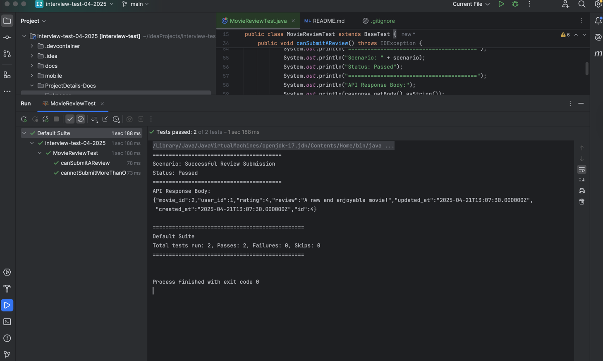
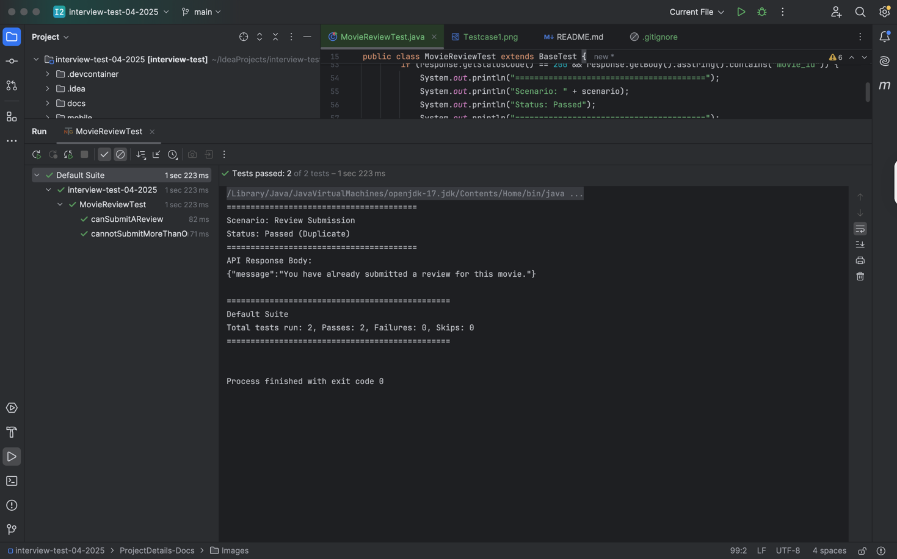

# Interview Test - Movie Review API QA Automation Guide

## 1. Introduction

This automated test suite is designed to rigorously validate the behavior of the Movie Review API's review submission endpoints.The suite covers both successful submission scenarios and the API's mechanisms for maintaining data integrity by preventing duplicate reviews from the same user for the same movie.

## 2. Key Objectives

* **Functional Validation:** To confirm that users can successfully submit new movie reviews with the expected data.
* **Data Integrity:** To verify the API's ability to prevent duplicate review submissions, ensuring data consistency.
* **API Contract Compliance:** To ensure that the API responses adhere to the expected status codes and data structures.
## 3. Technologies and Libraries

* **Java (Version 17):** The chosen programming language for its robustness, extensive libraries, and widespread adoption in enterprise applications.
* **TestNG (Version 7.4.0):** A powerful and flexible Java testing framework that provides rich annotations, test grouping, and reporting capabilities.
* **RestAssured (Version 4.4.0):** A Java DSL (Domain Specific Language) that simplifies the testing of RESTful APIs by providing an intuitive way to make HTTP requests and validate responses.
* **JSON (Version 20231013):** The standard data interchange format used for communication with the Movie Review API. The `org.json` library is used for creating and manipulating JSON objects within the tests.
* **Hamcrest (Version 2.2):** A library of matcher objects that, when used with RestAssured's fluent API, allows for expressive and readable assertions on API responses.

## 4. API Under Test

* **Base URL:** `http://localhost:8000/api`

* **Authentication Endpoint:** `POST /v1/login` (used to obtain the Bearer token)
* **Review Submission Endpoint:** `POST /v1/movies/{movieId}/reviews`

## 5. Test Suite Structure and Logic

The core test logic is implemented in the Java class `MovieReviewTest.java`, located within the package `com.review` under the `src/test/java` directory.

### 5.1. `getAuthToken()` (@BeforeClass)

* **Purpose:** This method, annotated with `@BeforeClass` from TestNG, ensures that a valid Bearer authentication token is obtained *once* before any of the test methods in the class are executed.
* **Functionality:** It sends a POST request to the `/v1/login` endpoint with predefined user credentials (`example@user.com` and `Demo@123`). It then extracts the `token` from the successful (200 OK) response and stores it in the `authToken` instance variable for use in subsequent API calls.

### 5.2. `canSubmitAReview()` (@Test)

* **Purpose:** This test method validates the successful submission of a new movie review. It also includes logic to gracefully handle scenarios where a duplicate review might be submitted during the test execution.
* **Steps:**
  1.  Constructs a JSON request body containing a movie rating (4) and a review text ("A new and enjoyable movie!").
  2.  Sends a POST request to the `/v1/movies/{movieId}/reviews` endpoint, replacing `{movieId}` with the value "2". The `Authorization` header is included with the obtained Bearer token, and the `Content-Type` is set to `application/json`.
  3.  Asserts that the API responds with either a `200 OK` status code (for a successful new submission) or a `409 Conflict` status code (if a duplicate is detected).
  4.  **Success Scenario (200 OK):** Verifies that the response body contains the submitted `review` text, `rating`, and a generated `id` for the review.
  5.  **Duplicate Scenario (409 Conflict):** Verifies that the response body contains the expected error message: `"message":"You have already submitted a review for this movie."`.
* **Key Assertion:** `Assert.assertTrue()` from TestNG is used to validate the presence of expected data in the API response body.
* **Reference Output:**
  
  *(Illustrates the API response after a successful first-time review submission (status code 200 and the review details).)*

### 5.3. `cannotSubmitMoreThanOneReview()` (@Test, `dependsOnMethods = "canSubmitAReview"`)

* **Purpose:** This test method specifically focuses on verifying the API's mechanism for preventing duplicate review submissions.
* **Dependencies:** The `@Test(dependsOnMethods = "canSubmitAReview")` annotation ensures that this test will only be executed after the `canSubmitAReview()` method has completed successfully. This is to ensure that a prior review (potentially) exists for the user and movie.
* **Steps:**
  1.  Constructs a JSON request body for a second review submission for the same `movieId` ("2") with a different rating (5) and review text ("Attempting a duplicate review.").
  2.  Sends a POST request to the `/v1/movies/{movieId}/reviews` endpoint, including the `Authorization` header and `Content-Type`.
  3.  Asserts that the API responds with a `409 Conflict` status code, indicating that the duplicate submission was correctly prevented.
  4.  Further asserts that the response body contains the specific error message: `"message": "You have already submitted a review for this movie."` using RestAssured's `body()` matcher with `equalTo()`.
* **Key Assertions:** `Assert.assertEquals()` from TestNG is used to verify the expected status code, and RestAssured's `body()` matcher is used for a more direct assertion on the error message in the response body.
* **Reference Output:**
  
  *(Illustrates the API response when attempting to submit a duplicate review (status code 409 and the "You have already submitted..." message).)*

## 6. Setup and Execution Instructions

To set up and run this test suite, please follow the instructions below:

### 6.1. Prerequisites

* **Java Development Kit (JDK):** Ensure a compatible JDK (version 17 or higher is recommended) is installed on your system.
* **Maven:** Download and install Apache Maven. Verify the installation by running `mvn -v` in your terminal.
* **Movie Review API:** Confirm that an instance of the Movie Review API is running and accessible at `http://localhost:8000`.

### 6.2. Project Setup

1.  **Clone the Repository:** Clone the Git repository containing this test suite to your local machine.
2.  **Navigate to the Project Directory:** Open your terminal or command prompt and navigate to the root directory of the cloned repository (where the `pom.xml` file is located).

### 6.3. Running the Tests via Maven

The test suite is configured to be executed using Maven. Open your terminal in the project root directory and run the following command:

```bash
mvn test